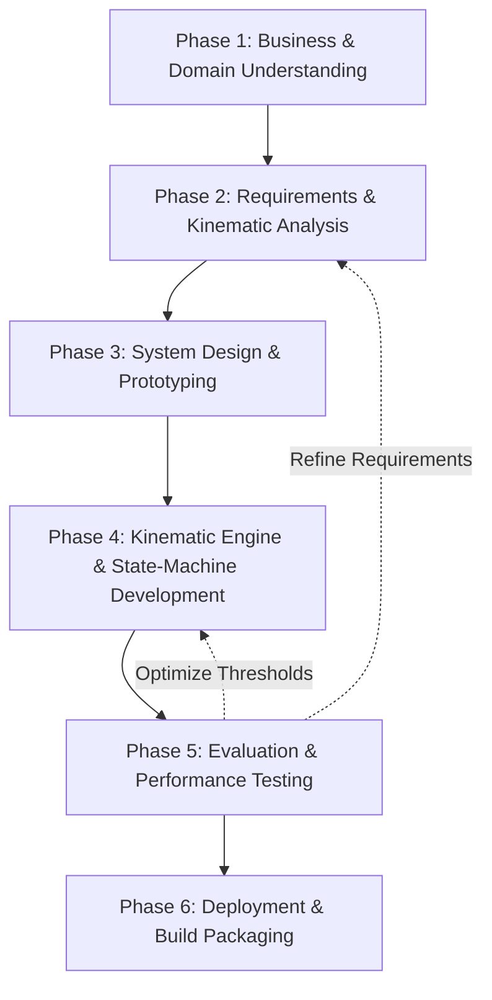

# CHAPTER 2: LITERATURE REVIEW AND PROJECT METHODOLOGY

## 2.1 Introduction
In this chapter, I go over the technical background and methodology behind building **Biomech-Coach**. First, we look at the main areas this project combines: lifting mechanics, mobile-based pose estimation, and mobile app development. After that, I evaluate five popular lift-tracking apps to point out what features they are missing. Then, we compare options for joint tracking—namely Google ML Kit, YOLOv8-pose, and OpenPose. I also explain why a mathematical state machine is more reliable for checking form than a standard machine learning classifier. Finally, I outline the CRISP-DM methodology, development requirements, and key project milestones.

## 2.2 Facts and Findings

### 2.2.1 Domain
This project sits at the intersection of weightlifting mechanics, on-device computer vision, and mobile app development.

In weightlifting kinematics, we need to track how joints move during the Big Three lifts: Squat, Bench Press, and Deadlift. To analyze form, the system must measure joint flexion angles and coordinate paths. For example, during a squat, the app tracks knee flexion, hip flexion, and torso lean. For a rep to be valid under competition rules, the hip crease must drop below the top of the knee. In the bench press, we track elbow flexion on the way down, the pause on the chest, and the extension back to lockout. The deadlift starts with bent knees and hips and ends with complete joint extension at lockout. Doing these lifts with poor posture—like letting your knees cave in (valgus collapse) during a squat or rounding your lower back (lumbar flexion) during a deadlift—puts a lot of stress on your joints and ligaments, which easily causes injury.

Edge AI means running machine learning models locally on a smartphone instead of a remote server. Traditionally, pose estimation needed powerful desktop GPUs. However, mobile-optimized models (like MobileNet) allow modern mobile processors to handle inference on their own. Running these models on the phone gets rid of network lag and keeps user videos completely private, since frames are processed in local memory and are never saved or uploaded.

### 2.2.2 Existing Systems
I reviewed five popular fitness and lift-tracking apps to see how they handle form checks and where they fall short.

**Iron Path** tracks the barbell's path by looking for the contrast of the weight plates. While it displays a nice line showing bar path drift after your set, it doesn't track your actual joints or calculate joint angles. Also, you have to manually tap the center of the plate on the screen before every set, which is annoying when training, and it doesn't give any live audio cues.

**Metric VBT** uses camera tracking to calculate how fast the bar is moving and how much power you are generating. It's great for velocity-based training, but it only works on iOS and requires a paid subscription. More importantly, it doesn't measure joint angles, check squat depth, or detect back rounding.

**Kaia Health** uses computer vision to guide rehabilitation and physical therapy exercises. However, it relies on cloud servers to analyze posture. While this is fine for slow therapy movements, the network delay makes it useless for heavy compound lifts, where warnings must be played instantly to prevent injury.

**MyLift** is a mobile app used in sports science to measure bar speed and estimate 1RM. Its main drawback is that you have to manually select the start and end frames of a lift on a timeline. This manual approach is accurate for research but is way too slow and tedious to use during a real workout.

**FormCheck AI** is a cloud service where you upload videos of your lifts for analysis. It generates detailed reports on your joint angles, but because it relies on cloud uploads, it cannot give you live, mid-rep audio warnings.

**Table 2.1: Summary of Reviewed Existing Systems**

| No. | System / App | Developer / Source | Approach | Strength | Limitation |
| :--- | :--- | :--- | :--- | :--- | :--- |
| 1 | **Iron Path** | Science for Sport (2020) | Plate-tracking from video (Post-lift) | Shows bar drift line clearly. | No joint tracking; manual setup needed; post-lift only. |
| 2 | **Metric VBT** | Metric (2023) | Real-time bar tracking | Accurate barbell velocity and power tracking. | Expensive; iOS only; doesn't check depth or joint angles. |
| 3 | **Kaia Health** | Kaia Health GmbH (2022) | Cloud pose estimation | Good postural guidance for slow rehab exercises. | Cloud delay is too slow; no powerlifting rules. |
| 4 | **MyLift** | Balsalobre-Fernández (2018) | Manual timeline scrubbing | Highly accurate for scientific research. | Completely manual; slow and tedious to use. |
| 5 | **FormCheck AI** | FormCheck (2024) | Cloud video uploads | Detailed joint angle reports post-workout. | Cannot give live audio alerts during the set. |

### 2.2.3 Technique
I evaluated a few different pose estimation models and decision logic methods to find the best fit for this project, as shown in Table 2.2.

**Table 2.2: Summary of Reviewed Techniques**

| No. | Technique | Category | Key Characteristic | Applicability to This Project |
| :--- | :--- | :--- | :--- | :--- |
| 1 | **Google ML Kit Pose** | Pose Estimation | Tracks 33 joints, optimized for mobile CPUs. | **Selected:** Runs locally at 30 FPS on mid-range phones; operates completely offline. |
| 2 | **YOLOv8-pose** | Pose Estimation | Multi-person keypoint detection. | Not selected: Too heavy; causes phone overheating and frame drops on CPU. |
| 3 | **OpenPose** | Pose Estimation | Bottom-up multi-person keypoint extraction. | Not selected: Huge model size; requires desktop GPU for real-time tracking. |
| 4 | **Trigonometric State Machine** | Decision Logic | Evaluates joint angles using the `atan2` function. | **Selected:** 100% predictable; easily maps to quantitative rules; no training data needed. |
| 5 | **ML Rep Classifier (LSTM)** | Decision Logic | Classifies reps as "good/bad" using a neural network. | Not selected: Black-box model; sensitive to camera angles; prone to false checks. |

I chose Google ML Kit Pose because it is optimized to run locally on mobile CPUs. It has a latency of under 30 milliseconds on mid-range Android phones, which avoids the lag, battery drain, and overheating issues that come with heavier models like YOLOv8-pose.

For checking lift form, I went with a rule-based state machine using trigonometric math rather than a machine learning classifier. An ML classifier is essentially a black box. It requires thousands of labeled training videos and can easily fail if you wear baggy clothes or train in a different gym with different lighting. In contrast, the kinematics engine calculates joint angles directly from coordinate pairs using the `atan2` function:

$$\theta = \left| \text{atan2}(y_c - y_b, x_c - x_b) - \text{atan2}(y_a - y_b, x_a - x_b) \right| \times \frac{180}{\pi}$$

This calculates the exact joint angle $\theta$ at joint vertex $b$ (such as the knee) using coordinates $a$ (hip) and $c$ (ankle). These calculations are fed directly into a state machine that tracks the lift's progress through states: `idle`, `descending`, `atDepth`, `ascending`, `lockout`, and `complete`. This method guarantees predictable results and aligns directly with the official rule books.

## 2.3 Project Methodology
Developing **Biomech-Coach** follows an adapted CRISP-DM methodology. This framework provides an iterative, structured workflow that works well for edge-AI software development, as shown in the diagram below:

### 2.3.1 Phase 1: Business and Domain Understanding
I analyzed the official IPF rule book to define target threshold angles for squats, benches, and deadlifts. I also gathered feedback from lifters on their preferred feedback type (real-time voice cues versus post-set charts).

### 2.3.2 Phase 2: Requirements and Kinematic Analysis
Here, I mapped physical lifting rules to specific joint coordinate groups (like the hip, knee, and ankle for squats). I defined the trigonometric formulas and designed local database tables to store workout history without needing the internet.

### 2.3.3 Phase 3: System Design and Prototyping
I designed the application architecture using the Model-View-Controller (MVC) pattern. This separates the camera capture code from the biomechanical state machine. I then created wireframe layouts for the camera tracking view, workout summaries, and history logs.

### 2.3.4 Phase 4: Kinematic Engine and State-Machine Development
I built the main modules by integrating the Flutter camera preview with the Google ML Kit library. I wrote the math calculations in `biomechanics_engine.dart` and the movement rules in `state_machine.dart`. I also integrated a Text-to-Speech library (`tts_coach.dart`) to play voice alerts when the state machine detects a form error.

### 2.3.5 Phase 5: Evaluation and Performance Testing
I tested the app's processing speed and tracking accuracy. I used a test set of lifting videos to make sure the app counted reps and identified depth errors correctly, confirming that the frame processing didn't lag on older devices.

### 2.3.6 Phase 6: Deployment and Build Packaging
Finally, I compiled the application into installable APK files. I tested it on physical phones in offline gym settings to make sure the camera detection, local database writes, and audio playback all worked without crashing.

## 2.4 Project Requirements

### 2.4.1 Software Requirement
* **Development OS:** Windows 10/11 or macOS.
* **Framework:** Flutter SDK (version 3.0 or above).
* **Programming Language:** Dart.
* **Libraries:** `google_mlkit_pose_detection` for tracking coordinates, `hive_flutter` for local key-value storage, and `flutter_tts` for voice coaching.
* **IDE:** VS Code or Android Studio.

### 2.4.2 Hardware Requirement
* **Development PC:** Minimum Intel i5/Ryzen 5 processor, 16 GB RAM, and 20 GB free disk space.
* **Android Test Device:** Android 8.0 (API Level 26) or above, minimum 4 GB RAM, Snapdragon 665 or equivalent.
* **iOS Test Device:** iOS 13.0 or above.
* **Camera:** Built-in mobile camera supporting at least 720p resolution at 30 FPS.
* **Speaker:** Phone speaker or headphones for hearing voice cues.

### 2.4.3 Other Requirement
* **Official IPF Rule Book:** Used to calibrate the target angle constants for depth and lockouts.
* **Phone Stand / Tripod:** Required to set up the phone camera at hip height (0.5–1.0m), placed perpendicular to the lifter's side (sagittal view) at a distance of 1.5–2.5 meters.
* **Lifting Area Lighting:** A well-lit space to prevent tracking errors or joint dropouts by the pose estimation model.

## 2.5 Project Schedule and Milestones
The project is divided across two semesters (PSM 1 and PSM 2) to ensure structured development. Table 2.3 lists the schedule and milestones.

**Table 2.3: Project Schedule and Milestones**

| No. | Activity | CRISP-DM Phase | Semester | Milestone / Deliverable |
| :--- | :--- | :--- | :--- | :--- |
| 1 | **Problem Analysis & Domain Review** | Business Understanding | PSM 1 | Outlined objectives, problem statements, and report structure. |
| 2 | **Existing System Evaluation** | Business Understanding | PSM 1 | Completed comparison tables of apps and techniques. |
| 3 | **Kinematic Formula Modeling** | Requirements Analysis | PSM 1 | Wrote mathematical definitions for joint tracking. |
| 4 | **UI & Architecture Design** | Design & Prototyping | PSM 1 | Created wireframe layouts and system flow diagrams. |
| 5 | **PSM 1 Report Submission** | Documentation | PSM 1 | Submitted report draft (Chapters 1, 2, and 3). |
| 6 | **Camera and ML Integration** | Development | PSM 2 | Working prototype capturing live camera frames. |
| 7 | **Math Engine Coding** | Development | PSM 2 | Completed joint angle calculations in code. |
| 8 | **State Machine Development** | Development | PSM 2 | Integrated Squat, Bench, and Deadlift rules. |
| 9 | **Database & Audio Cue Setup** | Development | PSM 2 | Set up local Hive storage and Text-to-Speech alerts. |
| 10 | **Usability & Accuracy Testing** | Evaluation | PSM 2 | Documented test results on frame rate and tracking accuracy. |
| 11 | **Final Release Build** | Deployment | PSM 2 | Compiled APK and installer files. |
| 12 | **Report Submission & Viva** | Documentation | PSM 2 | Completed final report and thesis presentation. |

## 2.6 Summary
In this chapter, I reviewed the background literature and methodology for the app. By comparing existing products, it became clear that no current app provides real-time, offline form feedback based on official powerlifting rules. Google ML Kit and a math-based state machine were selected as the core technologies. The project methodology follows an adapted CRISP-DM workflow, supported by specific hardware and software requirements. The next chapter will go into detail on the requirement analysis, detailing user flows, the data dictionary, and functional specifications.
