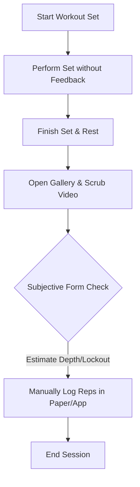
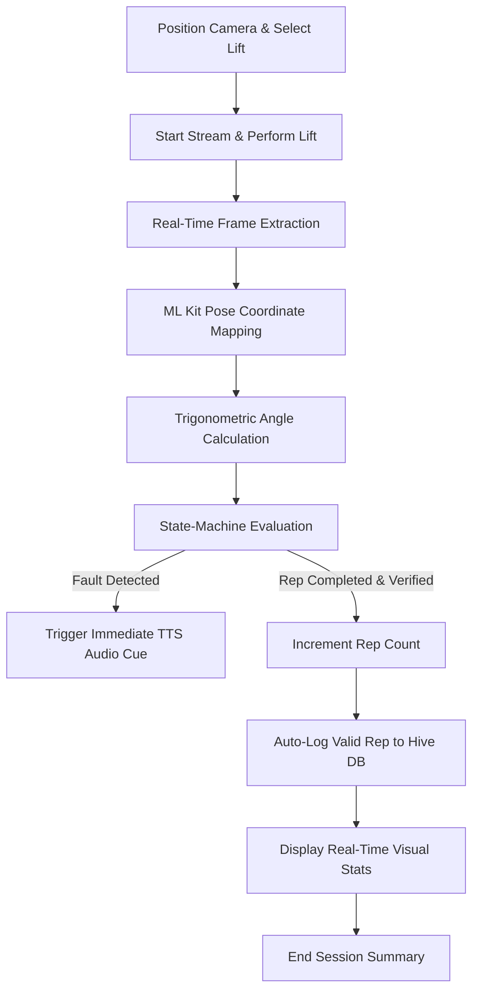

# CHAPTER 3: ANALYSIS

## 3.1 Introduction
In this chapter, I present the requirement analysis for **Biomech-Coach**. We begin by looking at the user workflow, comparing how athletes traditionally check their form with the automated, real-time method. Next, I list the database requirements, including a detailed data dictionary for the joint landmarks and database schemas. Finally, I define the functional and non-functional requirements and justify why I chose Flutter, ML Kit, and Hive for the software stack.

## 3.2 Problem Analysis
To see why **Biomech-Coach** is necessary, we have to look at how lifters check their form today.

Right now, logging sets and reviewing technique is a slow, subjective, and completely manual process. The typical workflow looks like this:
1. **Setup:** The lifter props their phone against a gym bag or a water bottle on the floor.
2. **Execution:** The lifter performs their set (for example, 5 reps of squats) without any live feedback.
3. **Review:** During their rest period, they open their photo gallery and scrub through the video, guessing if they hit squat depth or if their back rounded.
4. **Logging:** They write down the reps in a paper journal or a notes app, usually counting shallow or sloppy reps because of confirmation bias.

This traditional process is shown in the workflow diagram below:

This manual process has three major flaws:
* **Delayed feedback:** You only find out about form errors after the set is already over. If your lower back rounds on the first rep of a heavy deadlift set, checking your phone minutes later won't stop you from hurting yourself during the set.
* **Inaccurate logs:** Manual diaries don't filter out bad reps. Shallow squats and soft lockouts are recorded as successful volume, which makes it hard to track actual progressive overload.
* **Parallax errors:** Eyeballing depth from a raw video depends heavily on the camera angle, making self-assessment highly subjective and inaccurate.

**Biomech-Coach** automates this entire pipeline directly on the phone in real time. The user sets up the phone camera, starts the session, and lifts. The app processes the camera frames, maps skeletal coordinates, checks the rules using a state machine, plays immediate audio cues, and logs only the valid repetitions. This automated workflow is mapped below:

## 3.3 Requirement Analysis

### 3.3.1 Data Requirements
The app processes live camera frames, calculates joint angles, and writes session logs to local storage. Table 3.1 outlines the primary variables in the data dictionary.

**Table 3.1: Data Dictionary**

| Field Name | Data Type | Source | Location | Description |
| :--- | :--- | :--- | :--- | :--- |
| `landmark_coordinates` | Map<PoseLandmarkType, PoseLandmark> | Google ML Kit Pose Detector | Runtime Memory | The 3D coordinates (x, y, z) and confidence levels (0.0 to 1.0) for the 33 tracked skeletal landmarks. |
| `joint_angle` | double | BiomechanicsEngine | Runtime Memory | Calculated joint angle in degrees (0.0 to 180.0) for a joint vertex (like the knee formed by hip, knee, and ankle points). |
| `rep_state` | enum (RepState) | StateMachine | Runtime Memory | The current phase of the lift, tracking state transitions (idle, descending, atDepth, ascending, lockout, complete). |
| `rep_result` | RepResult Object | StateMachine | Runtime Memory | The validation summary of a completed rep, containing: isValid (boolean), formScore (double), depth/lockout angles, and error notes. |
| `session_record` | Hive Box (LiftSession) | DatabaseService | Local Hive DB | Persistent database entry storing session details: date, lift type, total reps, valid/invalid reps, and average form score. |

### 3.3.2 Functional Requirements
The functional capabilities of the system are divided into nine primary requirements (FR1 through FR9):

* **FR1 - Live Camera Feed:** The app must capture and process live camera frames at a minimum of 30 frames per second.
* **FR2 - Skeleton Overlay:** The app must draw a visual skeleton connecting keypoints over the camera view in real time.
* **FR3 - Angle Calculation:** The app must calculate joint flexion and torso angles locally using the `atan2` trigonometric function.
* **FR4 - Lift Selection:** The app must let the user select their active lift type (Squat, Bench Press, or Deadlift) to load the correct rules.
* **FR5 - State-Machine Tracking:** The app must run a state machine that transitions through lifting stages based on joint angle thresholds.
* **FR6 - Live Voice Cues:** The app must trigger Text-to-Speech (TTS) alerts immediately (latency < 100ms) when a form error is detected.
* **FR7 - Repetition Validation:** The app must log a rep as valid only if zero posture faults were detected and all depth/lockout rules were met.
* **FR8 - Local Database Log:** The app must save workout logs and set summaries to local storage using Hive.
* **FR9 - History Trend Charts:** The app must load saved workouts and display progress graphs showing volume and form scores over time.

### 3.3.3 Non-Functional Requirements
The non-functional requirements define the speed, reliability, and compatibility constraints of the application:

#### Performance
* **Inference Latency:** Frame extraction and angle calculations must execute in $\le 33$ milliseconds per frame on a Snapdragon 665 CPU to prevent camera lag.
* **Voice Cue Latency:** The delay between state machine fault detection and the start of the TTS audio alert must be $\le 100$ milliseconds.
* **Database Save Latency:** Local storage writes must complete in $\le 10$ milliseconds.

#### Reliability
* **Offline Independence:** All features (tracking, calculations, voice cues, and database storage) must work without cellular data or Wi-Fi.
* **Fault Tolerance:** The app must handle temporary camera occlusions (such as a plate briefly blocking a joint) without crashing, holding the state machine in the last valid state.

#### Usability
* **Three-Tap Workout Start:** The user must be able to start tracking a workout from the home screen in three taps or fewer.
* **Audio Voice Clarity:** Voice alerts must be clearly audible in typical gym environments with background music, using native system volume controls.

#### Compatibility
* **Android OS Compatibility:** The app must compile and run on devices running Android 8.0 (API Level 26) or higher.
* **iOS OS Compatibility:** The app must compile and run on devices running iOS 13.0 or higher.

#### Data Storage
* **Local Storage Consumption:** The local Hive database must not use more than 50 MB of storage space, even with multiple years of daily logs.
* **Installation File Size:** The compiled application bundle (APK/IPA) must be under 120 MB.

### 3.3.4 Other Requirements
* **Model acceleration:** The test phone must support Google Play Services (Android) or CoreML (iOS) for hardware-accelerated pose tracking.
* **Camera Setup:** The user must place the phone at hip height (about 0.75m), perpendicular to the lifter's side (sagittal view) and 1.5 to 2.5 meters away.

#### Why I chose this software stack
* **Flutter and Dart:** I chose Flutter because its rendering engine displays 2D joint lines at a smooth 60 FPS. Dart is ideal because I can run the frame processing on a separate background thread (isolate), ensuring the main UI never lags or freezes.
* **Google ML Kit Pose Detection:** ML Kit is used because it handles coordinate normalization and landmark visibility checks automatically, which saved me from writing a custom pose estimator parser.
* **Hive Local Database:** I chose Hive over SQLite because it is a lightweight, pure-Dart database that saves Dart objects directly. Since it doesn't require SQL query translations, writes are almost instant and don't cause performance drops during a workout set.

## 3.4 Summary
This chapter went over the system requirements for **Biomech-Coach**. By looking at the problems with manual post-workout reviews, the need for a low-latency, offline, on-device processing engine was clear. The data dictionary, functional requirements, and performance boundaries (like the 33ms limit per frame) set the stage for the system architecture. The next chapter will detail the system design, including database tables, class diagrams, and state transitions..
